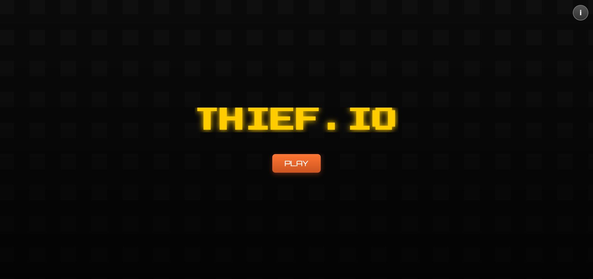
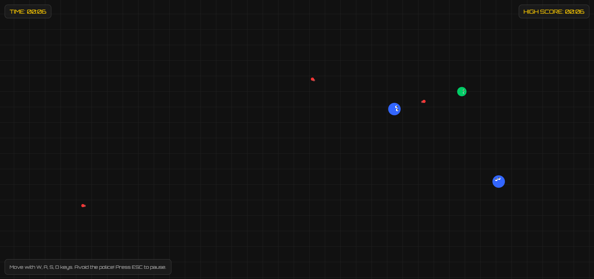
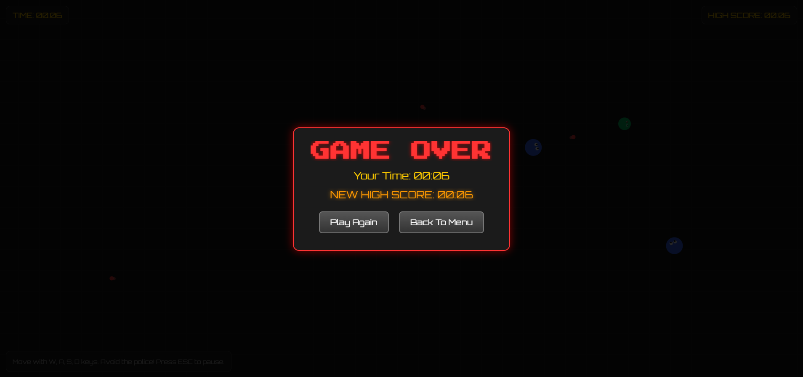

  
<h1 align="center">🌐 English</h1>

<h1 align="center">🚀 Project Title</h1>

A modern, visually enhanced, and easy-to-use template for web projects.

---

<h2>📖 About</h2>

This is a <strong>website-focused README template</strong> for modern web projects. You can use it directly in your repository without modifications. Add your website description and demo links to make it visually appealing.

<h2>⚙️ Installation</h2>

Clone the repository and open <code>index.html</code> in your browser, or host it with your preferred web server:

<pre><code>git clone https://github.com/yourusername/yourproject.git
cd yourproject
open index.html</code></pre>

<h2>🖼️ Screenshots / Demo</h2>

Here are some screenshots of the project:

  
  
  

<h2>🚀 Usage</h2>

Simply open <code>index.html</code> in your browser or host online.

<h2>🤝 Contributing</h2>
<ol>
  <li>Fork the repository</li>
  <li>Create a new branch</li>
  <li>Commit your changes</li>
  <li>Push the branch</li>
  <li>Create a pull request</li>
</ol>

<h2>📝 License</h2>

This project is licensed under the MIT License.

    

<h1 align="center">🇹🇷 Türkçe</h1>

<h1 align="center">🚀 Proje Başlığı</h1>

Modern, görsel açıdan zengin ve kullanımı kolay web projeleri için bir şablon.

---

<h2>📖 Hakkında</h2>

Bu dosya, modern web projeleri için özel hazırlanmış bir <strong>README şablonudur</strong>. Direkt olarak repoya ekleyip kullanabilirsiniz. Projenizin açıklamalarını ve demo linklerini ekleyerek daha bilgilendirici hâle getirebilirsiniz.

<h2>⚙️ Kurulum</h2>

Projeyi klonlayın ve <code>index.html</code> dosyasını tarayıcınızda açın veya istediğiniz web sunucusunda host edin:

<pre><code>git clone https://github.com/kullaniciadi/projeniz.git
cd projeniz
open index.html</code></pre>

<h2>🖼️ Ekran Görüntüleri / Demo</h2>

Projenin bazı ekran görüntüleri:

 
  
  

<h2>🚀 Kullanım</h2>

Sadece <code>index.html</code> dosyasını açın veya çevrimiçi olarak host edin.

<h2>🤝 Katkıda Bulunma</h2>
<ol>
  <li>Projeyi fork’layın</li>
  <li>Yeni bir branch oluşturun</li>
  <li>Değişikliklerinizi commit edin</li>
  <li>Branch’i push edin</li>
  <li>Pull request oluşturun</li>
</ol>

<h2>📝 Lisans</h2>

Bu proje MIT lisansı ile lisanslanmıştır.

